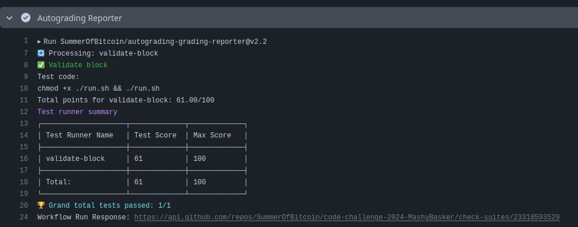

# Design Approach

The assignment requires implementing a program to mine a Bitcoin block by validating and including transactions from a given set of transactions. The key aspects of the design approach are:
- Filter the transaction files into different folders based on the `scriptpubkey_type` value from the `mempool`
- Validate the transactions from the respective folders.
- Mine the block from the provided transactions in the mempool to create the block header, coinbase transaction, and other valid transactions.
- Ensure the block hash meets the difficulty target.
- Format the output as specified in the requirements.

I divided the task into respective files and functions and finally called them in a pipelined manner through the `main.py` file.

# Implementation Details

### Verification
- Read all the transaction files from the `mempool` directory and get the respective fields necessary to execute the opcodes in the stack. If the stack returns `True`, the transaction is considered valid, otherwise invalid
- Implement `OP_CHECKSIG` for verifying the signature which included creating the message hash by carefully including fields in the correct order and be aware of the byte order
- Implement different helper and utility functions such as the double SHA256 hash function, merging the folders of the verified transaction files.
- Verify the signature using the `ecdsa` library.

### Mining
- Calculate the TXID of all the verified files for calculating the Merkle Root.
- Create the Coinbase transaction with the appropriate structure and format by using the witness root hash which is the Merkle Root of the wTXID of all the verified transactions.
- Calculate the block header by utilising the Merkle Root, previous block hash, timestamp, and the target difficulty and return the hash when the PoW algorithm meets the difficulty.
- Construct the final block by including the coinbase transaction and other valid transactions from the verified transaction files

Format of the block:
```
<block header>
<coinbase transactio>
<txid 1>
<txid 2>
<txid 3>
.
.
.<txid n>
```

# Results and Performance
My program receives 61/100 under 3 minutes


# Conclusion

This project was extremely illuminating to me. It made me realise and appreciate how much complexity lies under the largest blockchain network in the world. Doing this assignment improved my programming skills and understanding of blockchain concepts like transactions, mining, and block validation.